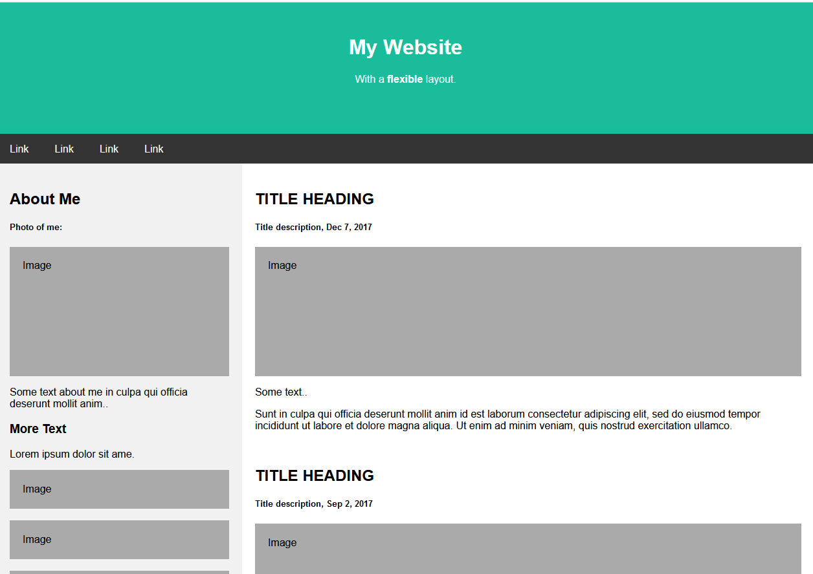
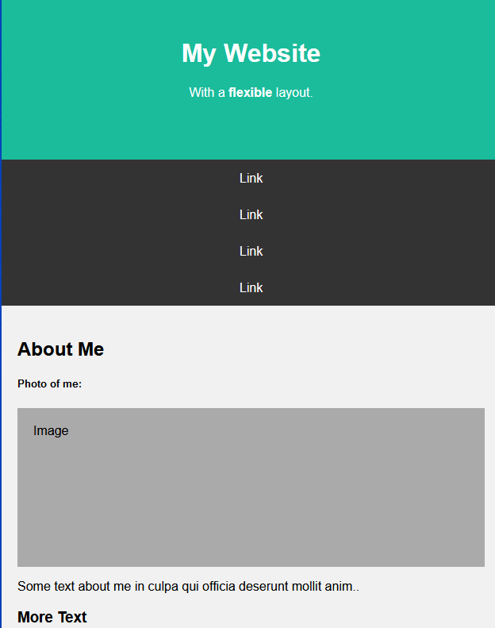

# Activity 2

Use flexbox to create a responsive website, containing a flexible navigation bar and flexible content:

In this activity, you'll follow the steps below to build a similar webpage to this screenshot:

Also we will CSS to make it responsive as follows:

### Reference:
https://www.w3schools.com/csS/css3_flexbox_responsive.asp