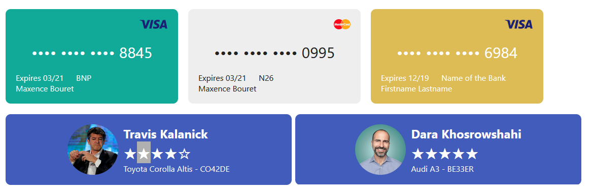

# Activity 3

In this activity, you'll use flexbox to build
- Credit card
- Id Card 

- Create a directory named `week3-lab03` and extract the [images](./img3.zip) into that directory. 
- Create an `index.html` file

Here are Unicode characters for both a filled star and an empty star:
- Filled Star: &#x2605;
- Empty Star: &#x2606;

### References

- https://github.com/ironhack-labs/lab-react-training
